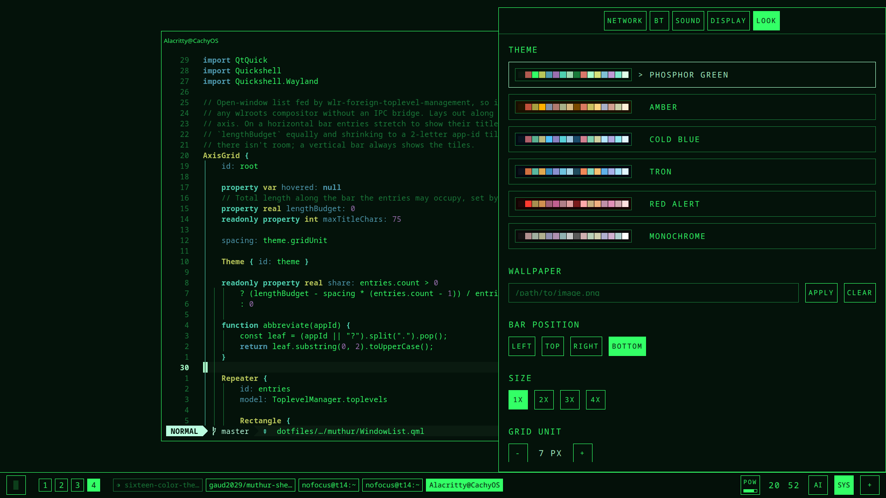
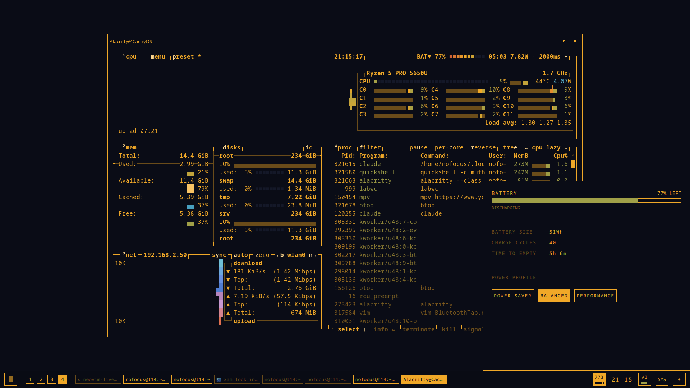
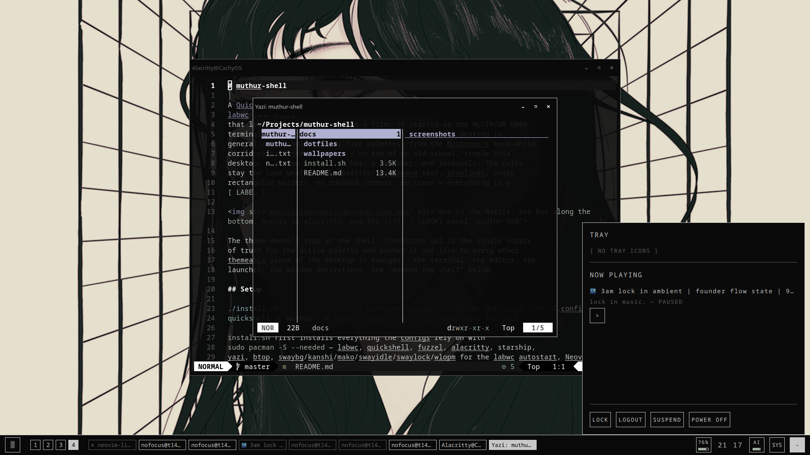
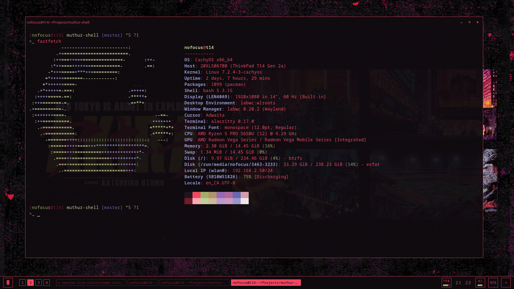
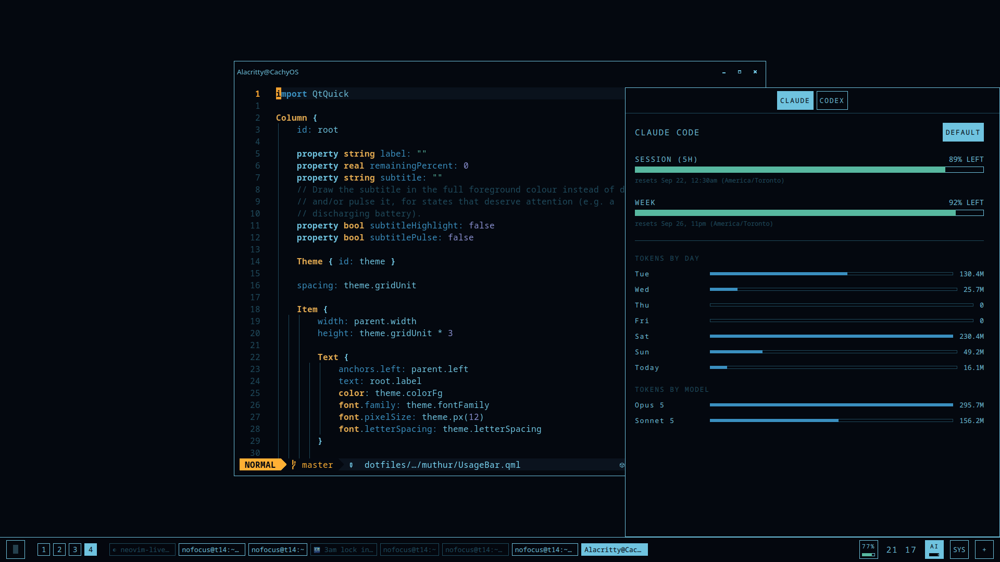

# muthur-shell

A [Quickshell](https://quickshell.outfoxxed.me/) desktop shell for
[labwc](https://labwc.github.io/) (and [Hyprland](https://hypr.land/) or
[niri](https://github.com/YaLTeR/niri)) that looks like a computer from a
film: it started as the MU/TH/UR 6000
terminal from *Alien* and grew into a sci-fi / cyberpunk desktop in
general — one shell, twenty-five palettes, from the Nostromo's bone-white
corridors to Night City neon — on top of an old-school, simple Unix
desktop: a window manager, a bar, a launcher, and terminals. The rules
stay the same whatever the palette: monospace text, scanlines, sharp
rectangular borders, no rounded corners, no icons — everything is a
`[ LABEL ]`.

 [LOOK] panel" width="960">

*Preset: **Neo in the Matrix** — Neovim in alacritty, and `[SYS] > [LOOK]` open on the preset list.*

The theme doesn't stop at the shell: `ThemeStore.qml` is the single source
of truth for the active palette and pushes it out live to every other
themeable piece of the desktop it manages — the terminal, the editor, the
launcher, the window decorations. See "Beyond the shell" below.

## Setup

```sh
./install.sh          # installs packages (pacman), symlinks dotfiles/ into ~/.config/
quickshell -c muthur   # launch (labwc's autostart does this for you)
```

`install.sh` first installs everything the configs rely on with
`sudo pacman -S --needed` — labwc, quickshell, fuzzel, alacritty, starship,
yazi, btop, swaybg/kanshi/mako/swayidle/swaylock/wlopm for the labwc autostart, Neovim,
Noto fonts, and the NetworkManager/BlueZ/PipeWire/UPower services the
panels talk to (`--no-packages` skips this; herdr isn't packaged and is
installed separately). It then backs up anything already at the
destination instead of overwriting it, and symlinks every config this repo
manages: the shell itself, plus fuzzel, labwc, alacritty, herdr, Neovim,
yazi, btop, `~/.bashrc` and the starship prompt, and makes yazi the default
handler for opening folders. Quickshell hot-reloads on file save, so once it's running most
changes to the QML don't need a restart.

## The bar

A thin strip on one screen edge — left by default, but `[SYS] > [LOOK]`
moves it to any of the four edges and every widget and popup follows the
orientation. It reserves its space, so windows never sit under it. Every
size in the shell derives from one grid unit (5px × a 1x–4x multiplier,
both adjustable), so the whole thing scales together, fonts included.

From the start of the bar:

- **Launcher** — a square button with a breathing cursor block. Opens
  `fuzzel` right beside it, wherever the bar is (`Super+Space` does the
  same from labwc).
- **Workspaces** — one tile per workspace, read through
  `ext-workspace-v1` (labwc, or any compositor implementing it), through
  Quickshell's native Hyprland module on Hyprland (special workspaces
  hidden, named ones after the numbered; switching works with both the
  classic and the Lua `hyprctl dispatch` syntax), and through niri's IPC
  as the fallback. Click to switch; urgent ones are highlighted. The
  labwc and Hyprland configs define four (`Super+1..4` to go,
  `Super+Shift+1..4` to send the window along, `Super+F` fullscreen,
  `Super+Return` a terminal, `Super+E` the file manager — yazi, in a
  terminal).
- **Window list** — one entry per open window via
  `wlr-foreign-toplevel-management`. On a horizontal bar entries show
  their titles, sharing 75% of the free length and eliding when squeezed;
  on a vertical bar they're two-letter app tiles. The focused window is
  filled, minimized ones dimmed; click to focus, middle-click to close,
  hover for the full title.

From the end of the bar:

- **`[POW]`** — battery, with the charge level as a bar under the label
  (green, then yellow under 50%, red under 20%). The label alternates with
  the percentage once charge drops under 80% and the bar blinks under 50%.
  Opens the power panel: charge state, battery size, cycle count, time to
  empty/full and power-profile switching.
- **Clock** — opens a month calendar with today highlighted.
- **`[AI]`** — Claude Code / Codex usage (below). With a default agent
  chosen, its 5-hour session quota shows as a bar under the label, like
  `[POW]`.
- **`[SYS]`** — the system panel (below).
- **`[+]`** — the drawer: system tray, MPRIS "now playing" with
  previous / play-pause / next, and along its bottom edge the session
  controls — `LOCK` (`swaylock`), `LOGOUT` (`labwc --exit`), `SUSPEND` and
  `POWER OFF` (`systemctl`). The last three arm on a first click and run
  on a second within four seconds, so a stray click can't put the session
  down.



*Preset: **Blade Runner** — btop in alacritty, and the `[POW]` panel open.*

Only one of the `[SYS]` / `[AI]` / clock / `[POW]` panels is open at a
time; the drawer is independent and can sit alongside one. Every popup
closes on <kbd>Escape</kbd>, and they overlay windows rather than
reserving space, so the tiling layout never shifts.

## `[SYS]` — network, bluetooth, sound, display, look

- **NETWORK** — Wi-Fi on/off and the visible networks with signal
  strength.
- **BT** — devices split into `CONNECTED` / `PAIRED` / `AVAILABLE`; a
  pairing agent auto-registers, so no `bluetoothctl` setup.
- **SOUND** — output/input volume sliders with mute toggles and a device
  picker for each.
- **DISPLAY** — screen brightness, one slider per kernel backlight device
  (labeled with its output), set through logind's `SetBrightness` so no
  root helper is needed; polls sysfs while open so the brightness keys are
  reflected. External monitors (DDC/CI) aren't covered.
- **LOOK** — everything about the appearance:
  - twenty-five color presets, each a full 16-color palette previewed
    in its row — Neo in the Matrix, Blade Runner, Tron, Tron Ares,
    Hackers 1995, Ghost in the Shell, Cybergoth, Blade Runner 2049,
    Nostromo, Neuromancer, Akira, Deus Ex, Serial Experiments Lain,
    Cyberpunk 2077, SHODAN, The Fifth Element, RoboCop, Minority Report,
    Johnny Mnemonic, Altered Carbon, Psycho-Pass, Cowboy Bebop,
    MU-TH-UR 6000, E-Ink and Monochrome. Nostromo, Lain and E-Ink are
    light;
  - a **WALLPAPERS PATH** (default `~/Pictures/Wallpapers`) whose images
    show as a thumbnail grid (up to 24). Click one: `scripts/wallpaper-palette.py`
    (ImageMagick, no pywal needed) derives one more preset from the
    image's dominant hue in the same muted style, applies it everywhere
    and shows the image with `swaybg`; the choice persists across
    restarts (`CLEAR` goes back to a solid theme-colored background);
  - the bar position, the 1x–4x size multiplier and the base grid unit
    (3–10px), with a readout of the resulting bar and font size; fuzzel's
    font follows the size too;
  - a **TERMINAL OPACITY** slider for alacritty, reloaded live by open
    terminals.

  All of it persists in `theme.ini` (gitignored) and applies immediately.



*Preset: **Monochrome**, with a wallpaper set and **terminal opacity at 90%** — Neovim and yazi let the image show through, and the `[+]` drawer is open.*



*Preset: **Wallpaper** — the palette generated from an *Akira* wallpaper (Kaneda red pulled from the poster), with fastfetch in a terminal at **94% opacity** so the poster reads through it.*

## `[AI]` — Claude Code / Codex usage

Session (5h) and weekly quota bars for both CLIs — from Claude Code's own
usage report and Codex's `app-server` JSON-RPC protocol — with reset times
in local time, and under them **tokens by day** (last 7 days) and **tokens
by model**, aggregated by `scripts/ai-usage-stats.py` from the CLIs' local
session logs (`~/.claude/projects`, `~/.codex/sessions`; this machine only,
cached input counted like the CLIs do). Each tab has a `DEFAULT` toggle:
that agent's session bar then lives under the `[AI]` button, refreshed
every 10 minutes in the background (every minute while its tab is open).



*Preset: **Tron** — Neovim on a QML file, and the `[AI]` panel on the Claude Code tab.*

## Beyond the shell — theming the rest of the desktop

Switching presets in `[SYS] > [LOOK]` regenerates config for everything
else the shell manages, using whatever mechanism each tool supports:

| Tool | How | File |
|---|---|---|
| **fuzzel** | `fuzzel.ini` `include=`s a generated file (colors and font) | `colors.ini` |
| **labwc** | `themerc-override` (labwc's own override mechanism; no `<theme><name>` is set, so it's the *only* file that applies — structural settings like button size and title alignment live here too) | `themerc-override` |
| **alacritty** | `alacritty.toml`'s `general.import` (16 ANSI colors, cursor, selection, window opacity). Alacritty only makes its *default* background translucent, so below 100% the Neovim and btop themes are regenerated to leave their window background unpainted and show through | `colors.toml` |
| **herdr** | no include mechanism exists, so the `[theme.custom]` block in `config.toml` is patched in place between marker comments, then `herdr server reload-config` applies it live | *(in place)* |
| **Neovim (LazyVim)** | a real colorscheme (`colors/muthur.lua`, ~140 highlight groups incl. treesitter/LSP/diagnostics, plus the 16 terminal colors) that a plugin spec sets as `opts.colorscheme`; a file watcher in `lua/config/autocmds.lua` re-applies it in already-open instances the moment it's regenerated | `colors/muthur.lua` |
| **btop** | a theme file in its `themes/` directory (hex colors only, so it's generated: one border color for every box, inverted selection, green→yellow→red level gradients); `btop.conf` selects it, and a running btop reloads it on `SIGUSR2`, which is sent after every write | `themes/muthur.theme` |
| **starship** | nothing generated: `starship.toml` only uses ANSI color names (`green`, `bright-black`…), so the prompt follows alacritty's palette by itself | *(static config)* |
| **yazi** | nothing generated either: `theme.toml` uses only ANSI color names, so the file manager follows alacritty's palette live, open windows included. It's also styled to match — plain lines for borders, `[ LABELS ]`, inverted hover, and every icon rule emptied out so a row is just its name | *(static config)* |
| **swaybg** | restarted with the wallpaper, or the theme's background color when none is set | *(process)* |
| **Claude Code** | not generated at all — `~/.claude/settings.json` has `"theme": "dark-ansi"`, so it renders with the terminal's 16 ANSI colors and inherits alacritty's automatically | *(static setting)* |

Every preset is a full palette in [pywal](https://github.com/dylanaraps/pywal)'s
`colors.json` shape — `special.background/foreground/cursor` plus
`colors.color0..15` in ANSI order — which is also what the wallpaper
generator produces. The shell's own four colors derive from it (bg =
background, fg = foreground, dim = color8, focus = cursor), and the twelve
hue slots are deliberately muted and pulled toward each theme's base:
alacritty's ANSI colors, herdr's tokens and the editor's syntax groups get
their usual meanings (strings green, errors red, keywords blue…) yet still
read as one phosphor screen rather than a rainbow. The shell itself uses
those slots sparingly and by meaning — level bars go green/yellow/red,
sliders fill in cyan, statistics in blue. Tron is the exception that
proves the rule: a cyan grid with the orange Clu accent as focus — and
Tron Ares is its mirror, scarlet light lines with a white-hot core.
The neon ones — Hackers 1995, Cybergoth, Cyberpunk 2077, Akira, Altered
Carbon — break it on purpose and leave their hue slots glowing. Nostromo
and Serial Experiments Lain invert it: bone-white and pale-grey
backgrounds with dark text, where `color0` is *lighter* than the
background so panel surfaces lift off it and `color15` is near-black,
pywal's convention for light palettes. E-Ink is Monochrome's light twin:
paper grey, ink black, and hue slots that are barely tinted greys.

Claude Code's own custom-theme system is tied to its plugin mechanism and
isn't documented for direct use, so `dark-ansi` sidesteps it by deferring
to the terminal; `~/.claude/settings.json` (which also holds permissions
and hooks) isn't tracked here — the one-line change was made directly.

## Inspirations

- The look is the MU/TH/UR 6000 from *Alien* first, then the rest of the
  shelf: *Blade Runner*, *Tron*, *Akira*, *Ghost in the Shell*, *Serial
  Experiments Lain*, *Neuromancer*, *Hackers*… each of which is a preset
  in `[SYS] > [LOOK]`.
- Several panels were heavily inspired by the
  [Omarchy](https://omarchy.org/) project — the `[AI]` panel in
  particular, with its Claude Code / Codex usage bars and token stats, is
  a MU/TH/UR take on Omarchy's AI usage view.
- The old-school side — one config per tool, symlinked from a dotfiles
  directory, nothing generated that a plain text file can't hold — is
  just how Unix desktops have always been put together.

## Repo layout

```
dotfiles/
  quickshell/muthur/  the shell (QML) — ThemeStore.qml is the theme hub;
                      scripts/ holds the palette and usage-stats helpers
  fuzzel/             launcher config, themed to match the shell
  labwc/              window-manager config: themed, 4 workspaces, keybinds, autostart
  hypr/               the same for Hyprland (Lua config), themed via the generated colors.lua
  alacritty/          terminal config, themed
  herdr/              config.toml for the terminal workspace manager, themed
  nvim/               LazyVim config, themed (and live-reloaded)
  yazi/               file manager config in the shell's style, themed via ANSI colors
  btop/               system monitor config, themed
  bash/               ~/.bashrc
  starship/           prompt config in the shell's [ LABEL ] style, themed via ANSI colors
docs/screenshots/    the captures above
wallpapers/
install.sh
```

Generated, gitignored files (`theme.ini`, `colors.ini`, `themerc-override`,
`hypr/colors.lua`, `colors.toml`, `colors/muthur.lua`, `themes/muthur.theme`) live alongside their tracked static
config — see `.gitignore`. `nvim/` is symlinked as a whole directory like
the others; `herdr/config.toml` is symlinked individually since the rest of
`~/.config/herdr/` is runtime state that doesn't belong in this repo.
