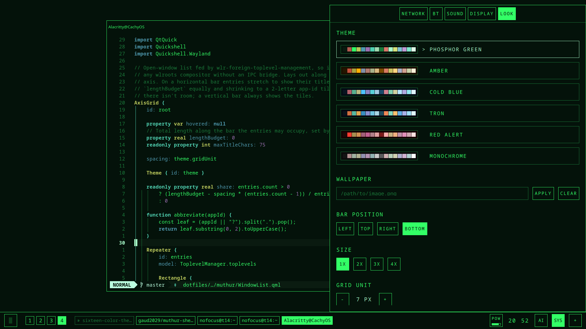
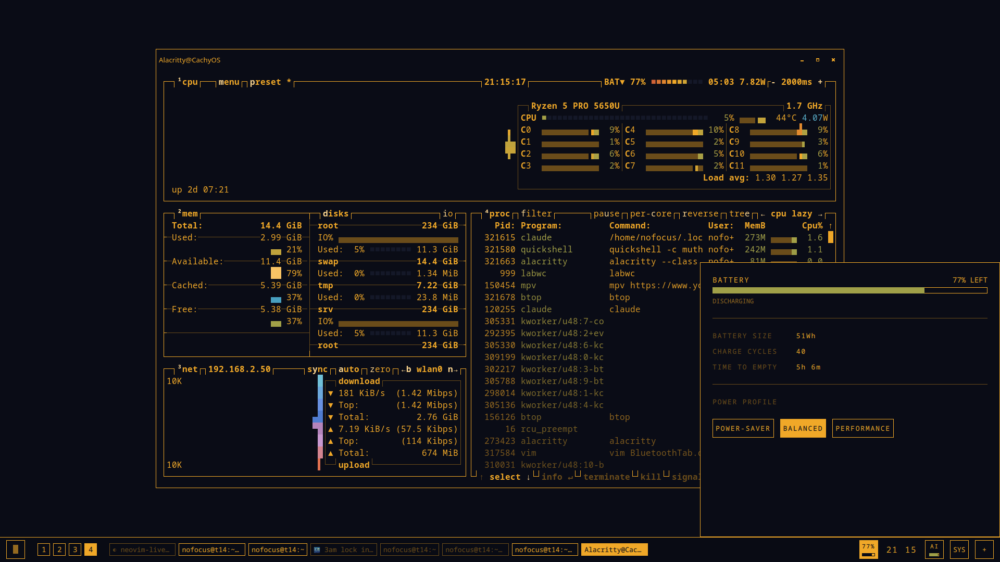
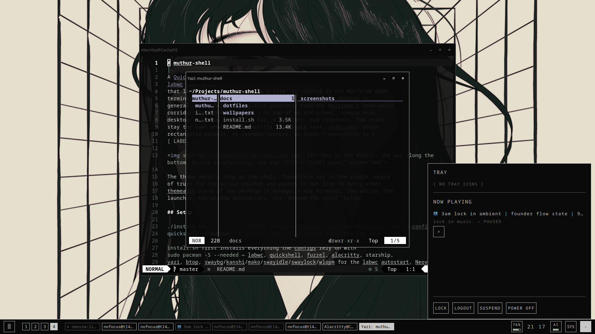
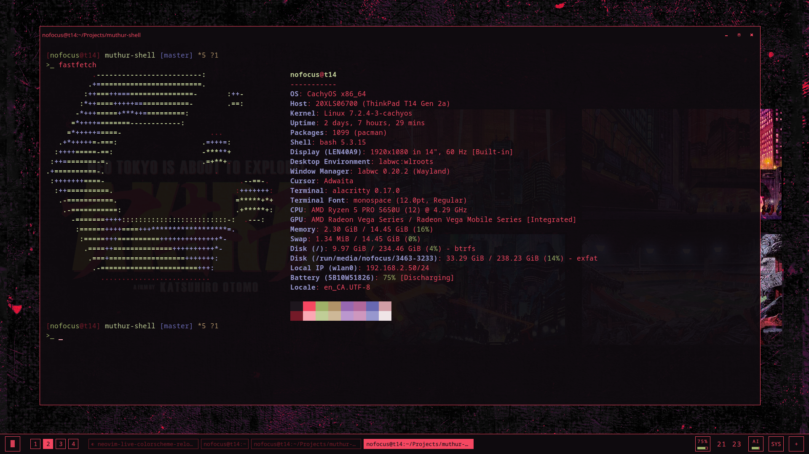
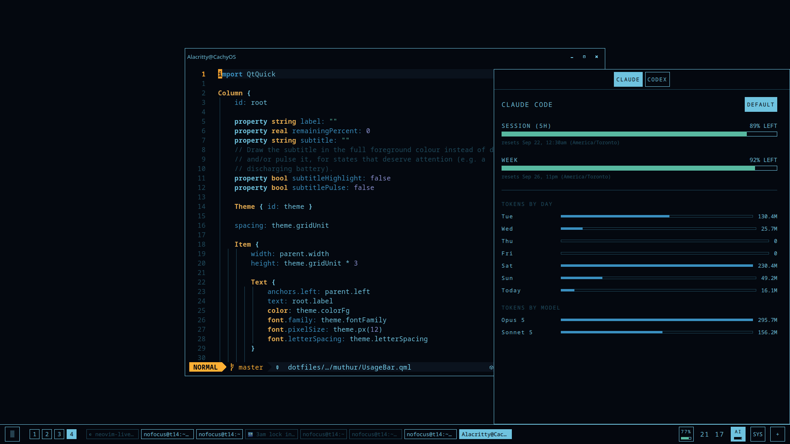

# muthur-shell

A [Quickshell](https://quickshell.outfoxxed.me/) desktop shell for
[labwc](https://labwc.github.io/) that looks like a computer from a
film: it started as the MU/TH/UR 6000
terminal from *Alien* and grew into a sci-fi / cyberpunk desktop in
general — one shell, twenty-seven palettes, from the Nostromo's bone-white
corridors to Night City neon — on top of an old-school, simple Unix
desktop: a window manager, a bar, a launcher, and terminals. The rules
stay the same whatever the palette: monospace text, scanlines, sharp
rectangular borders, no rounded corners, no icons — everything is a
`[ LABEL ]`.

## video demonstration
https://www.youtube.com/watch?v=jaJeYJUHUKg

 [LOOK] panel" width="960">

*Preset: **Neo in the Matrix** — Neovim in alacritty, and `[SYS] > [LOOK]` open on the preset list.*

The theme doesn't stop at the shell: `ThemeStore.qml` is the single source
of truth for the active palette and pushes it out live to every other
themeable piece of the desktop it manages — the terminal, the editor, the
launcher, the window decorations. See "Beyond the shell" below.

## Setup

```sh
./install.sh          # installs packages (pacman), symlinks dotfiles/ into ~/.config/
quickshell -c muthur   # launch (labwc's autostart does this for you)
```

> **Back up your dotfiles first.** The shell takes over your desktop
> configuration: existing configs are moved aside and replaced, and
> generated files are rewritten on every theme switch.

`install.sh` only runs on **CachyOS** (it exits on anything else) and
asks for confirmation before changing anything (`--yes` skips the
prompt). It first installs everything the configs rely on with
`sudo pacman -S --needed` — labwc, quickshell, fuzzel, alacritty, starship,
yazi, btop, swaybg/kanshi/mako/swayidle/wlopm for the labwc autostart (and
swaylock, the fallback locker),
grim/slurp/wl-clipboard for the screenshot keys, Neovim,
Noto fonts, and the NetworkManager/BlueZ/PipeWire/UPower services the
panels talk to (`--no-packages` skips this; herdr isn't packaged and is
installed separately). It then backs up anything already at the
destination instead of overwriting it, and symlinks every config this repo
manages: the shell itself, plus fuzzel, labwc, alacritty, herdr, Neovim,
yazi, btop, `~/.bashrc` and the starship prompt, and makes yazi the
default handler for opening folders. A `gtk-3.0`/`gtk-4.0` `gtk.css`
the shell didn't write is backed up too, since the shell regenerates it. Quickshell hot-reloads on file save, so once it's running most
changes to the QML don't need a restart.

### Optional: the MU/TH/UR boot chain

The lock screen comes with the shell. The boot menu, boot screen, login
screen and typing sounds are opt-in, each with its own installer (they need root, so
run them from a terminal: sudo asks for your password) and a `--revert`:

| Screen | Install | Revert | Details |
|---|---|---|---|
| Boot menu (Limine) | `dotfiles/limine/install-limine.sh` | `… --revert` | [below](#the-boot-menu--limine) |
| Boot screen (Plymouth) | `dotfiles/plymouth/install-plymouth.sh` | `… --revert` | [below](#the-boot-screen--plymouth) |
| Login screen (SDDM) | `dotfiles/sddm/install-sddm.sh` | `… --revert` | [below](#the-login-screen--sddm) |
| Typing sounds | `dotfiles/keysound/install-keysound.sh` | `… --revert` | [below](#typing-sounds) |
| Lock screen | `./install.sh` | swaylock, see [below](#the-lock-screen--muthur-6000) | |

### Optional: snap-to-grid and angled corners on labwc

Two settings in the labwc config need a patched labwc:

- `<snapping><grid><size>10</size></grid></snapping>` aligns windows to a
  10px grid while you move or resize them (on resize, only the edges you
  drag). Edge resistance and snapping still take precedence over the grid.
- `<corners>` cuts the titlebar's top corners at 45 degrees (16px on the
  left, 8px on the right) instead of rounding them.

Stock labwc has neither: it silently ignores both and keeps square
corners. They come from small patches in
[gaud2029/labwc](https://github.com/gaud2029/labwc/tree/angled-corner),
branched from the 0.20.2 release (the `angled-corner` branch has both,
`snap-to-grid` only the grid). The `vertical-titlebar` branch adds, on
top of both, a **Titlebar ▸ Top / Left / Right** entry to the window
menu (right-click a titlebar) that moves that window's titlebar to a
side, its title written along it. Stock labwc logs an error for that
entry and it does nothing. To get all three:

```sh
git clone -b vertical-titlebar https://github.com/gaud2029/labwc.git
cd labwc/dev/pkg && makepkg -si   # builds labwc-snapgrid, replaces labwc
```

Log out and back in to run the new binary. `sudo pacman -S labwc` goes
back to the stock package.

## The bar

A thin strip on one screen edge — left by default, but `[SYS] > [LOOK]`
moves it to any of the four edges and every widget and popup follows the
orientation. It's on every screen, or only on the main one
(`[SYS] > [DISPLAY]`). It reserves its space, so windows never sit under it. Every
size in the shell derives from one grid unit (5px × a 1x–4x multiplier,
both adjustable), so the whole thing scales together, fonts included.

From the start of the bar:

- **Focus mode** — a square button with a breathing cursor block. Click
  it and the whole bar folds away on every screen, leaving only that
  cursor in the corner; click again to bring it back. Its space stays
  reserved, so windows don't move or resize. Open popups close on the way
  out. Also `quickshell ipc -c muthur call focus toggle`. (The launcher,
  `fuzzel`, is on `Super+Space`.)
- **Workspaces** — one tile per workspace, read from labwc through
  `ext-workspace-v1`. Click to switch; urgent ones are highlighted. The
  labwc config defines four (`Super+1..4` to go, `Super+Alt+1..4` to
  send the window along, `Super+F` fullscreen, `Super+Return` a terminal,
  `Super+E` the file manager — yazi, in a terminal). Screenshots are
  macOS-style: `Super+Shift+3` the whole screen, `Super+Shift+4` a
  region (both saved to `~/Pictures/Screenshots`), `Ctrl+Super+Shift+4`
  a region to the clipboard.
- **Window list** — one entry per open window via
  `wlr-foreign-toplevel-management`. On a horizontal bar entries show
  their titles, sharing 75% of the free length (short titles take only
  what they need, the longer ones split the rest) and eliding when squeezed;
  on a vertical bar they're two-letter app tiles. The focused window is
  filled, minimized ones dimmed; click to focus, middle-click to close,
  hover for the full title.

From the end of the bar:

- **Now playing** — the current MPRIS track (title — artist, dimmed
  while paused) with `|<` / `||` / `>|` buttons; hidden while nothing is
  playing or paused. A vertical bar has no room for the title and keeps
  only the buttons. The drawer below shows the same player.
- **Keyboard layout** — the active layout's code (`US`, `CA`, ...). Click
  to switch to the next configured layout, right-click to open
  `[SYS] > [KEYBOARD]`. Also from a script or keybind:
  `quickshell ipc -c muthur call keyboard next`.
- **`[POW]`** — battery, with the charge level as a bar under the label
  (green, then yellow under 50%, red under 20%). The label alternates with
  the percentage once charge drops under 80% and the bar blinks under 50%.
  Opens the power panel: charge state, battery size, cycle count, time to
  empty/full and power-profile switching.
- **Clock** — opens a month calendar with today highlighted.
- **`[AI]`** — Claude Code / Codex usage (below). With a default agent
  chosen, its 5-hour session quota shows as a bar under the label, like
  `[POW]`.
- **`[SYS]`** — the system panel (below).
- **`[+]`** — the drawer: system tray, MPRIS "now playing" with
  previous / play-pause / next, and along its bottom edge the session
  controls — `LOCK` (the lock screen below), `LOGOUT` (`labwc --exit`), `SUSPEND` and
  `POWER OFF` (`systemctl`). The last three arm on a first click and run
  on a second within four seconds, so a stray click can't put the session
  down.



*Preset: **Blade Runner** — btop in alacritty, and the `[POW]` panel open.*

Only one of the `[SYS]` / `[AI]` / clock / `[POW]` panels is open at a
time; the drawer is independent and can sit alongside one. Every popup
closes on <kbd>Escape</kbd>, and they overlay windows rather than
reserving space, so the window layout never shifts.

## `[SYS]` — network, bluetooth, audio, display, keyboard, look

- **NETWORK** — Wi-Fi on/off and the visible networks with signal
  strength.
- **BT** — devices split into `CONNECTED` / `PAIRED` / `AVAILABLE`; a
  pairing agent auto-registers, so no `bluetoothctl` setup.
- **AUDIO** — output/input volume sliders with mute toggles and a device
  dropdown for each.
- **DISPLAY** — screen brightness, one slider per kernel backlight device
  (labeled with its output), set through logind's `SetBrightness` so no
  root helper is needed; polls sysfs while open so the brightness keys are
  reflected. External monitors (DDC/CI) aren't covered. An **ARRANGE**
  button opens `wdisplays` for output position, mode and scale. **MAIN DISPLAY** picks one of the connected screens, and **BAR ON**
  puts the bar on all of them or only on that one.
- **KEYBOARD** — the configured layouts (click one to make it active,
  `REMOVE` to drop it), a search over every layout and variant xkb knows
  to add more (`fr`, `canada`, `dvorak`...), and key repeat: rate and
  delay sliders with a field to try them in. labwc has no action to
  switch layouts, so the shell writes the active one alone to
  `labwc/environment.d/muthur-keyboard.env` (`XKB_DEFAULT_LAYOUT`) and
  reconfigures labwc; key repeat is rewritten in place in `rc.xml`
  (`<repeatRate>` / `<repeatDelay>`). Also the **typing sound** theme,
  volume and ambience ([below](#typing-sounds)).
- **LOOK** — everything about the appearance:
  - twenty-seven color presets, each a full 16-color palette (its first
    four colors shown in its row), with four wallpapers of its own on the
    right (below) — Neo in the Matrix, Blade Runner, Tron, Tron Ares,
    Hackers 1995, Ghost in the Shell, Cybergoth, Blade Runner 2049,
    Nostromo, Neuromancer, Akira, Deus Ex, Serial Experiments Lain,
    Cyberpunk 2077, SHODAN, The Fifth Element, RoboCop, Minority Report,
    Johnny Mnemonic, Altered Carbon, Psycho-Pass, Cowboy Bebop,
    MU-TH-UR 6000, E-Ink, Monochrome, and Corpo Carbon and Corpo Carbon
    Light (plain greys for work: easy on the eyes, still well contrasted),
    listed in `DARK` and `LIGHT`
    groups (Nostromo, Lain and E-Ink are light; the WALLPAPER palette is
    sorted by its background);
  - a **WALLPAPERS PATH** (default `~/Pictures/Wallpapers`) whose images
    show as a thumbnail grid (up to 24). Click one: `scripts/wallpaper-palette.py`
    (ImageMagick, no pywal needed) derives one more preset from the
    image's dominant hue in the same muted style, applies it everywhere
    and shows the image with `swaybg`; the choice persists across
    restarts (`CLEAR` goes back to a solid theme-colored background).
    **ON PICK** decides what a click does to the colors: `USE ITS COLORS`
    switches to that palette, `KEEP THEME` only changes the image (the
    palette is still offered as the WALLPAPER preset). `wallpapers/generate.py`
    draws a set in the shell's palettes into that folder ([below](#wallpapers));
  - the bar position, the 1x–4x size multiplier and the base grid unit
    (3–10px), with a readout of the resulting bar and font size; fuzzel's
    font follows the size too;
  - a **FONT** dropdown listing the installed monospace families, each
    drawn in its own face, for the shell, fuzzel and alacritty (Noto Sans
    Mono by default, and the fallback when the chosen one is uninstalled);
  - a **TERMINAL OPACITY** slider for alacritty, reloaded live by open
    terminals.

  All of it persists in `theme.ini` (gitignored) and applies immediately.



*Preset: **Monochrome**, with a wallpaper set and **terminal opacity at 90%** — Neovim and yazi let the image show through, and the `[+]` drawer is open.*



*Preset: **Wallpaper** — the palette generated from an *Akira* wallpaper (Kaneda red pulled from the poster), with fastfetch in a terminal at **94% opacity** so the poster reads through it.*

## Typing sounds

An ambience while you type, picked in `[SYS] > [KEYBOARD]`. Every key
press makes a sound placed where the key is: on headphones the far ear
hears it a fraction of a millisecond later and a little softer, so typing
moves from ear to ear. Under it an ambience swells while you type and ebbs
away a few seconds after the last key. Everything is synthesized on the
fly; there are no sound files.

The keys:

| Theme | Sound |
|---|---|
| MU/TH/UR | terminal blips |
| NOSTROMO | heavy deck clicks over a low thunk |
| NOSTROMO THOCC | deep and creamy, all body and no click: a lubed board on a heavy case |

The ambience, chosen separately:

| Ambience | Sound |
|---|---|
| THEME DRONE | the key theme's binaural drone: a close pitch in each ear, heard as a slow beat inside the head (theta for MU/TH/UR, alpha for the NOSTROMOs) |
| VESSEL | inside the ship: air handling, a deep rumble, the hull ticking or something clanking far off now and then — no pitch to fix on |
| HULL RAIN | rain on the hull: a fine hiss overhead, a muffled roar, drops all around, a leak to the left |
| SOFT RAIN | rain heard through thick plating: a muffled wash swelling in slow gusts, the odd heavy drop — nothing high |
| LOWER DECK | machinery turning over below: a broad throb with no pitch, a steam vent letting go now and then |
| BRIDGE | a quiet room: soft air and relays ticking in the consoles around you |
| LIFE SUPPORT | ventilation breathing in and out on a slow cycle, a console chirping now and then |

Space, Enter and Backspace have their own sounds; modifiers are silent.
VOLUME sets the whole thing, AMBIENCE LEVEL the ambience alone (0 for
keys only).

Two pieces, both from `dotfiles/keysound/`:

- **`muthur-keysound-input`**, a system service, reads the keyboards. It
  runs as a throwaway user in the `input` group inside a tight sandbox,
  opens the keyboards only while the shell is listening, and passes on
  nothing but "a key, of this kind, about here" (seven positions, left to
  right) over `/run/muthur-keysound/events.sock`. The keycode is dropped on
  the spot, so no user process gets keyboard access and nothing that leaves
  the service can be turned back into text.
- **`muthur-keysound`**, the player the shell starts while a theme is
  picked: one persistent PipeWire stream at ~5 ms latency, about 1% of a
  core while sounding and close to nothing when quiet.

### Install

From a terminal (sudo asks for your password; needs gcc and PipeWire's
headers, both there on CachyOS):

```sh
dotfiles/keysound/install-keysound.sh            # build the player into /usr/local/bin, install and start the service
dotfiles/keysound/install-keysound.sh --status   # check
```

Then pick a theme in `[SYS] > [KEYBOARD]`; `TEST` plays a sweep across the
keyboard. The panel says what's missing if either piece isn't there.
Rerun the installer after changing the player or the service.

### Revert

Picking `OFF` stops the player. To remove everything:

```sh
dotfiles/keysound/install-keysound.sh --revert   # stop and remove the service, the player and their files
```

## `[AI]` — Claude Code / Codex usage

Session (5h) and weekly quota bars for both CLIs — from Claude Code's own
usage report and Codex's `app-server` JSON-RPC protocol — with reset times
in local time, and under them **tokens by day** (last 7 days) and **tokens
by model**, aggregated by `scripts/ai-usage-stats.py` from the CLIs' local
session logs (`~/.claude/projects`, `~/.codex/sessions`; this machine only,
cached input counted like the CLIs do). Each tab has a `DEFAULT` toggle:
that agent's session bar then lives under the `[AI]` button, refreshed
every 10 minutes in the background (every minute while its tab is open).



*Preset: **Tron** — Neovim on a QML file, and the `[AI]` panel on the Claude Code tab.*

## The lock screen — MU/TH/UR 6000

Locking (the drawer's `LOCK`, or swayidle after 2 hours idle and before
suspend) turns every screen into the MU/TH/UR 6000 terminal on an old CRT:
the tube powers on — a beam opening into the picture — and MU/TH/UR types
its greeting and asks for an ident under a big clock, over the wireframe
ground plane of the Nostromo's descent displays, with scanlines, a rolling
band, the odd flicker and a phosphor glow, all in the active preset's
colors.

- **Type the password and press Enter.** It shows as `*`; Backspace,
  Ctrl+Backspace / Ctrl+U / Escape to clear. `VERIFYING IDENT` sweeps
  while PAM decides; a refusal tears and shakes the picture and MU/TH/UR
  answers in red; `ACCESS GRANTED` in green, then the tube collapses to a
  line and a dot and the session unlocks.
- **Authentication** goes through PAM's `login` stack, like swaylock, so
  the system's policy applies — including faillock (by default three
  failures lock the account for 10 minutes; MU/TH/UR relays PAM's
  messages).
- **Idle**: after 30 s at an empty prompt everything but the clock dims and
  the picture drifts a few pixels a minute, to spare the panel.
- **From outside**: `quickshell ipc -c muthur call lock lock`.
  `scripts/lock.sh` does that and waits for the compositor to confirm the
  lock (so swayidle's `before-sleep` can't suspend first), falling back to
  swaylock when the shell isn't running.
- **If the shell restarts while locked** (a hot reload, or a crash), the
  compositor keeps the session locked and a new instance locks again on its
  own (a flag in `$XDG_RUNTIME_DIR` remembers). Should the shell be dead
  for good, switch to a TTY and start it again with
  `WAYLAND_DISPLAY=wayland-0 quickshell -c muthur -d`: it comes back up
  locked, and unlocks with your password.

### Install

Nothing to do beyond `./install.sh`: the lock screen is part of the shell,
and `dotfiles/labwc/autostart` (symlinked as `~/.config/labwc/autostart`)
starts swayidle with `scripts/lock.sh` as the locker:

```sh
LOCK=~/.config/quickshell/muthur/scripts/lock.sh
swayidle -w \
	timeout 7200 "$LOCK" \
	timeout 600 'wlopm --off \*' \
	resume 'wlopm --on \*' \
	before-sleep "$LOCK" >/dev/null 2>&1 &
```

That's: lock after 2 hours idle, screens off after 10 minutes (back on
at the first input), and lock before suspend. Change the delays there
(in seconds). They apply at the next login, or
right away by restarting swayidle with the same arguments
(`pkill -x swayidle`, then run the two lines above from a terminal).

### Revert

To lock with swaylock again instead, point `LOCK` at it in
`dotfiles/labwc/autostart` and log in again:

```sh
LOCK="swaylock -f -c 000000"
```

The drawer's `LOCK` button keeps using the MU/TH/UR screen. To stop
locking on idle altogether, delete the `timeout 7200 "$LOCK"` line
(keep `before-sleep` so suspend still locks). `scripts/lock.sh` already
falls back to swaylock by itself whenever the shell isn't running.

## The boot screen — Plymouth

`dotfiles/plymouth/muthur/` is a Plymouth theme in the same voice as the
lock screen: the tube powers on, MU/TH/UR types its header, every unit
systemd starts scrolls by as a console line (marked `[ OK ]` when the
next one starts) over a `LOADING [####....] 042%` bar, and the LUKS
passphrase is asked for by the same `[ PRIORITY ONE ]` / `IDENTIFY:`
console. Shutdown and reboot get their own header and a `POWERING DOWN`
line. Fixed palette (black, bone, grey, phosphor green), not the shell's
preset: the theme lives in the initramfs.

### Install

It isn't installed by `install.sh`: it needs root and rebuilds the
initramfs. From a terminal (sudo asks for your password):

```sh
dotfiles/plymouth/install-plymouth.sh --preview   # optional: play it in a window first, no reboot
dotfiles/plymouth/install-plymouth.sh             # copy it to /usr/share/plymouth/themes/muthur,
                                                  # make it the default theme, rebuild the initramfs
```

Then reboot. `--preview` uses Plymouth's X11 renderer through Xwayland,
so it needs `xorg-xhost` (it lets root's `plymouthd` in for the run, then
revokes it). Kernel upgrades keep the theme: mkinitcpio rebuilds the
initramfs with the configured default. Rerun the installer after changing
the theme.

### Revert

```sh
dotfiles/plymouth/install-plymouth.sh --revert    # back to the cachyos theme, initramfs rebuilt
```

If the theme ever misbehaves at boot, <kbd>Esc</kbd> switches Plymouth to
plain text (the disk passphrase is still asked for), and removing `splash`
from the kernel command line in Limine's menu (<kbd>E</kbd> on the entry)
boots without Plymouth at all.

## The boot menu — Limine

Before Plymouth, Limine's menu gets the same tube: a still of the
wireframe descent under scanlines (`dotfiles/limine/muthur/wallpaper.png`,
drawn by `make-wallpaper.sh`), the entries in phosphor green, and
`MU/TH/UR 6000 // SELECT BOOT SEQUENCE` as the branding line.

`limine.conf` is CachyOS's: limine-entry-tool rewrites its boot entries on
every kernel or snapshot update but keeps the global options at the top,
so the theme lives there as one marked block. The theme options CachyOS
ships are commented out with a `#muthur# ` prefix rather than deleted,
and the config's checksum is re-enrolled when that protection is enabled.

### Install

From a terminal (sudo asks for your password):

```sh
dotfiles/limine/install-limine.sh           # copy the wallpaper to the ESP (/boot/muthur/),
                                            # add the theme block to limine.conf
dotfiles/limine/install-limine.sh --show    # check: the theme options limine.conf has now
```

Then reboot. `limine.conf` is backed up first as `limine.conf.muthur-bak`.
Running it again replaces the block (after `make-wallpaper.sh`, say)
instead of adding a second one; kernel updates keep it.

### Revert

```sh
dotfiles/limine/install-limine.sh --revert  # remove the block and /boot/muthur/,
                                            # re-enable the CachyOS theme options
```

A theme option Limine doesn't like never stops it from booting: at worst
the menu looks off. The previous config stays in `limine.conf.muthur-bak`.

## The login screen — SDDM

`dotfiles/sddm/muthur/` turns SDDM's greeter into the lock screen: the
same tube, terrain, clock and `[ PRIORITY ONE ]` console, with MU/TH/UR
naming the vessel and the crew member before asking for the ident. A
refused password tears and shakes the picture; an accepted one powers
the tube off as the session starts.

Keys: type the password and <kbd>Enter</kbd>; <kbd>↑</kbd>/<kbd>↓</kbd>
for another crew member, <kbd>F1</kbd> for another session,
<kbd>F10</kbd>/<kbd>F11</kbd>/<kbd>F12</kbd> to suspend, restart or power
off (twice — the first press only arms, like the drawer). The status
line's items do the same on click.

It reuses the shell's `CrtScreen.qml`, `VectorTerrain.qml` and
`TypedText.qml` (copied in at install, since the greeter's `sddm` user
can't read `/home`), with a fixed palette in its own `Theme.qml`.

### Install

From a terminal (sudo asks for your password):

```sh
dotfiles/sddm/install-sddm.sh --preview   # optional: the greeter on every screen for 30 s,
                                          # no root; test mode, so logging in does nothing
dotfiles/sddm/install-sddm.sh             # copy it to /usr/share/sddm/themes/muthur and
                                          # select it in /etc/sddm.conf.d/muthur.conf
```

The next login screen (log out, or reboot) uses it. Rerun the installer
after changing the theme or the shell files it borrows.

### Revert

```sh
dotfiles/sddm/install-sddm.sh --revert    # remove /etc/sddm.conf.d/muthur.conf: SDDM's default theme
```

Stuck at the login screen? Switch to a TTY (<kbd>Ctrl</kbd>+<kbd>Alt</kbd>+<kbd>F3</kbd>),
log in, run `--revert`, then `sudo systemctl restart sddm`.

## Wallpapers

### Every theme's own four

Each preset comes with four quiet wallpapers drawn in its colors — the
main one, plus the palette's third and fourth — and almost no text:

1. **GRID** — a fine drafting grid, a few colored crosses on the major lines
2. **TOPO** — topographic lines, the preset's name small in a corner
3. **HORIZON** — the lock screen's wireframe ground plane fading into a horizon
4. **DOTS** — a dot matrix swelling and thinning like a halftone

In `[SYS] > [LOOK]` they appear as four small sketches to the right of the
preset's name (the same vector drawings for every preset, in its colors,
so nothing heavy is loaded). Click one to switch to that preset with that
wallpaper; click the name or the swatch for the preset with its first
one. They're pre-drawn by `wallpapers/themed.py`, which reads the presets
from `ThemeStore.qml` (about three seconds and 2 MB per preset):

```sh
wallpapers/themed.py                   # every preset, into ~/.local/share/muthur-shell/wallpapers
wallpapers/themed.py tron corpoCarbon  # only these
```

A preset without drawn wallpapers simply shows no sketches; new ones
appear the next time the tab opens.

### A set of nine

`wallpapers/generate.py` draws nine wallpapers in the shell's palettes —
SVG written by hand, rendered by `rsvg-convert` — into
`~/Pictures/Wallpapers`, where `[SYS] > [LOOK]` lists them:

| File | Look |
|---|---|
| `muthur-corpo-carbon`, `-light` | topographic lines over a faint dot grid, one in steel blue, for work |
| `muthur-crt-phosphor`, `-amber` | the lock screen's tube as a still: header, Special Order 937, the wireframe descent, scanlines |
| `muthur-nostromo-schematic-bone`, `-dark` | a technical drawing of the Nostromo: side elevation, dimensions, callouts, title block |
| `muthur-flow-neo` | streamlines through a noise field, in Neo's greens |
| `muthur-ridges-hackers` | stacked ridgelines, cyan to magenta |
| `muthur-contours-tron` | glowing contour lines with one orange level |

```sh
wallpapers/generate.py                          # 3440x1440 into ~/Pictures/Wallpapers
wallpapers/generate.py ~/elsewhere --size 1920x1080 --only flow-neo
```

The same size always draws the same images; swaybg crops to fill each
screen, and the designs keep their subject clear of the sides.

## Beyond the shell — theming the rest of the desktop

Switching presets in `[SYS] > [LOOK]` regenerates config for everything
else the shell manages, using whatever mechanism each tool supports:

| Tool | How | File |
|---|---|---|
| **fuzzel** | `fuzzel.ini` `include=`s a generated file (colors and font) | `colors.ini` |
| **labwc** | `themerc-override` (labwc's own override mechanism; no `<theme><name>` is set, so it's the *only* file that applies — structural settings like button size and title alignment live here too) | `themerc-override` |
| **alacritty** | `alacritty.toml`'s `general.import` (16 ANSI colors, cursor, selection, window opacity, font family; the rest, font size included, stays in `alacritty.toml`). Alacritty only makes its *default* background translucent, so below 100% the Neovim and btop themes are regenerated to leave their window background unpainted and show through | `theme/muthur.toml` |
| **Neovim (LazyVim)** | a real colorscheme (`colors/muthur.lua`, ~140 highlight groups incl. treesitter/LSP/diagnostics, plus the 16 terminal colors) that a plugin spec sets as `opts.colorscheme`; a file watcher in `lua/config/autocmds.lua` re-applies it in already-open instances the moment it's regenerated | `colors/muthur.lua` |
| **btop** | a theme file in its `themes/` directory (hex colors only, so it's generated: one border color for every box, inverted selection, green→yellow→red level gradients); `btop.conf` selects it, and a running btop reloads it on `SIGUSR2`, which is sent after every write | `themes/muthur.theme` |
| **herdr** | nothing generated: its built-in `terminal` theme draws with the terminal's ANSI colors, so it follows alacritty's palette by itself (herdr has no include mechanism, and patching the tracked `config.toml` would dirty the repo on every preset switch) | *(static config)* |
| **starship** | nothing generated: `starship.toml` only uses ANSI color names (`green`, `bright-black`…), so the prompt follows alacritty's palette by itself | *(static config)* |
| **yazi** | nothing generated either: `theme.toml` uses only ANSI color names, so the file manager follows alacritty's palette live, open windows included. It's also styled to match — plain lines for borders, `[ LABELS ]`, inverted hover, and every icon rule emptied out so a row is just its name | *(static config)* |
| **Apps on "automatic"** (libadwaita/GTK4, Qt, Firefox, Electron…) | `gsettings set org.gnome.desktop.interface color-scheme prefer-light\|prefer-dark` from the preset's light/dark group; xdg-desktop-portal serves it as `org.freedesktop.appearance color-scheme` and apps switch live. GTK3 apps ignore it, so an `adw-gtk3` theme is swapped for `adw-gtk3`/`adw-gtk3-dark` to match | *(gsettings)* |
| **GTK4 / libadwaita and GTK3** | GTK loads a user `gtk.css` over its theme: the GTK4 one sets libadwaita's color variables (window, view, headerbar, sidebar, cards, popovers, accent, borders…), the GTK3 one the same names as `@define-color`, which adw-gtk3 honors; both color selected rows too. Open apps re-read it on a light↔dark switch, otherwise on their next start. Any hand-written `gtk.css` there is overwritten | `gtk-4.0/gtk.css`, `gtk-3.0/gtk.css` |
| **Firefox** | `scripts/firefox-theme.py` writes the chrome colors (tab strip, toolbars, URL bar and its dropdown, menus, sidebar, accent) into each profile Firefox starts, `@import`s them from `userChrome.css` (anything hand-written there is kept) and enables `toolkit.legacyUserProfileCustomizations.stylesheets` in `user.js`. Firefox reads it at startup only, so restart it after a switch; pages follow light/dark live through `color-scheme` | `chrome/muthur.css` |
| **swaybg** | restarted with the wallpaper, or the theme's background color when none is set | *(process)* |
| **Claude Code** | not generated at all — `~/.claude/settings.json` has `"theme": "dark-ansi"`, so it renders with the terminal's 16 ANSI colors and inherits alacritty's automatically | *(static setting)* |

Every preset is a full palette in [pywal](https://github.com/dylanaraps/pywal)'s
`colors.json` shape — `special.background/foreground/cursor` plus
`colors.color0..15` in ANSI order — which is also what the wallpaper
generator produces. The shell's own four colors derive from it (bg =
background, fg = foreground, dim = color8, focus = cursor), and the twelve
hue slots are deliberately muted and pulled toward each theme's base:
alacritty's ANSI colors and the editor's syntax groups get
their usual meanings (strings green, errors red, keywords blue…) yet still
read as one phosphor screen rather than a rainbow. The shell itself uses
those slots sparingly and by meaning — level bars go green/yellow/red,
sliders fill in cyan, statistics in blue. Tron is the exception that
proves the rule: a cyan grid with the orange Clu accent as focus — and
Tron Ares is its mirror, scarlet light lines with a white-hot core.
The neon ones — Hackers 1995, Cybergoth, Cyberpunk 2077, Akira, Altered
Carbon — break it on purpose and leave their hue slots glowing. Nostromo
and Serial Experiments Lain invert it: bone-white and pale-grey
backgrounds with dark text, where `color0` is *lighter* than the
background so panel surfaces lift off it and `color15` is near-black,
pywal's convention for light palettes. E-Ink is Monochrome's light twin:
paper grey, ink black, and hue slots that are barely tinted greys.

Claude Code's own custom-theme system is tied to its plugin mechanism and
isn't documented for direct use, so `dark-ansi` sidesteps it by deferring
to the terminal; `~/.claude/settings.json` (which also holds permissions
and hooks) isn't tracked here — the one-line change was made directly.

## Inspirations

- The look is the MU/TH/UR 6000 from *Alien* first, then the rest of the
  shelf: *Blade Runner*, *Tron*, *Akira*, *Ghost in the Shell*, *Serial
  Experiments Lain*, *Neuromancer*, *Hackers*… each of which is a preset
  in `[SYS] > [LOOK]`.
- Several panels were heavily inspired by the
  [Omarchy](https://omarchy.org/) project — the `[AI]` panel in
  particular, with its Claude Code / Codex usage bars and token stats, is
  a MU/TH/UR take on Omarchy's AI usage view.
- The old-school side — one config per tool, symlinked from a dotfiles
  directory, nothing generated that a plain text file can't hold — is
  just how Unix desktops have always been put together.

## Repo layout

```
dotfiles/
  quickshell/muthur/  the shell (QML) — ThemeStore.qml is the theme hub;
                      scripts/ holds the palette and usage-stats helpers
  fuzzel/             launcher config, themed to match the shell
  labwc/              window-manager config: themed, 4 workspaces, keybinds, autostart, 10px grid, angled corners
  keysound/           typing sounds: keypress feed service, PipeWire player (C) and their installer
  limine/             MU/TH/UR boot menu theme (wallpaper + limine.conf block) and its installer
  plymouth/           MU/TH/UR boot screen (Plymouth script theme) and its installer
  sddm/               MU/TH/UR login screen (SDDM greeter theme) and its installer
  alacritty/          terminal config, themed
  herdr/              config.toml for the terminal workspace manager, themed via ANSI colors
  nvim/               LazyVim config, themed (and live-reloaded)
  yazi/               file manager config in the shell's style, themed via ANSI colors
  btop/               system monitor config, themed
  bash/               ~/.bashrc
  starship/           prompt config in the shell's [ LABEL ] style, themed via ANSI colors
docs/screenshots/    the captures above
wallpapers/
install.sh
```

Generated, gitignored files (`theme.ini`, `keyboard.ini`, `colors.ini`,
`themerc-override`, `environment.d/muthur-keyboard.env`,
`theme/muthur.toml`, `colors/muthur.lua`, `themes/muthur.theme`) live alongside their tracked static
config — see `.gitignore`. `nvim/` is symlinked as a whole directory like
the others; `herdr/config.toml` is symlinked individually since the rest of
`~/.config/herdr/` is runtime state that doesn't belong in this repo.
